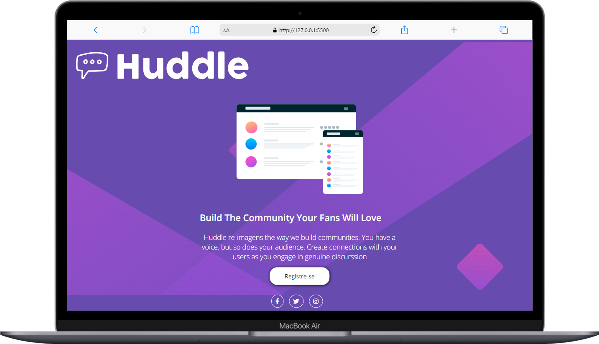
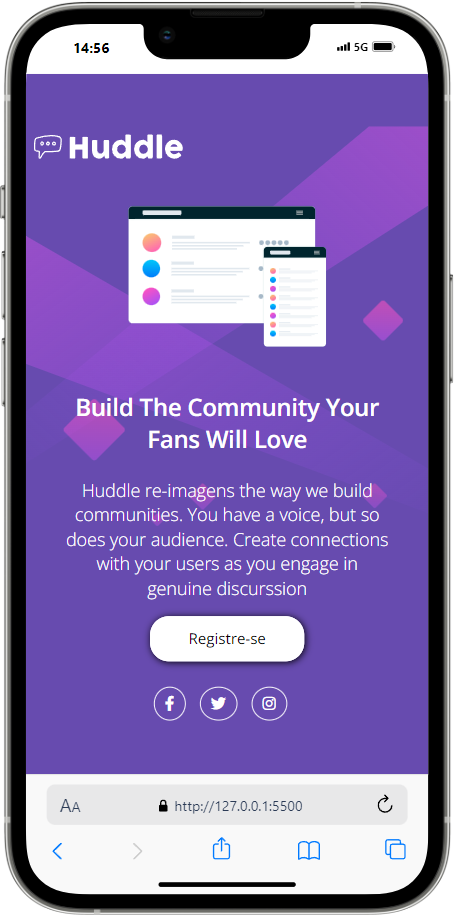
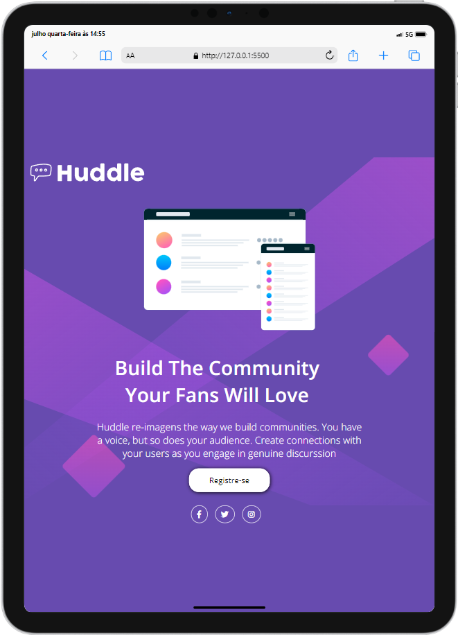

# Landing Page✅

Esse projeto é uma atividade proposta pelo curso que eu faço DevQuest, essa atividade serviu para colocar em prática tudo que foi ensinado durante o módulo de HTML/CSS Avançado

## Screenshot 
Desktop 💻

Mobile 📱

Tablet 📱

## Tecnologias utilizadas 👨‍💻
- HTML
- CSS
